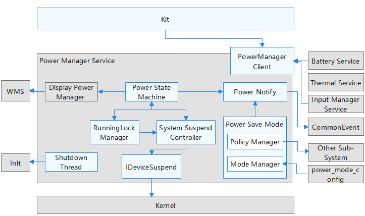

# 电源管理服务组件<a name="ZH-CN_TOPIC_0000001115047353"></a>

-   [简介](#section11660541593)
-   [目录](#section19472752217)
-   [相关仓](#section63151229062)

## 简介<a name="section11660541593"></a>

电源管理服务组件提供如下功能：

1.  重启系统。
2.  管理休眠运行锁。
3.  系统电源状态查询。

**图 1**  电源管理服务组件架构图<a name="fig106301571239"></a> 


## 目录<a name="section19472752217"></a>

```
/base/powermgr/power_manager
├── figures                  	# 架构图
├── frameworks                  # FrameWork层
│   ├── dialog                  # Dialog 资源文件
│   ├── include                 # 头文件
│   ├── napi                  	# NAPI
│   └── native                  # Native层
├── interfaces                  # 接口层
│   ├── innerkits               # 内部接口
│   ├── kits                    # 外置接口
│   └── test                    # Kits 测试
├── sa_profile                  # SA 配置文件
├── services                    # 服务层
│   ├── native                  # Native 层
│   └── zidl                    # Zidl 接口层
├── test                        # 测试用例
│   ├── fuzztest                # Fuzz 测试
│   └── systemtest              # 系统测试
└── utils                       # 工具和通用层
```


## 相关仓<a name="section63151229062"></a>

[电源管理子系统](https://gitee.com/openharmony/docs/blob/master/zh-cn/readme/%E7%94%B5%E6%BA%90%E7%AE%A1%E7%90%86%E5%AD%90%E7%B3%BB%E7%BB%9F.md)

**powermgr_power_manager**

[powermgr_display_manager](https://gitee.com/openharmony/powermgr_display_manager)

[powermgr_battery_manager](https://gitee.com/openharmony/powermgr_battery_manager)

[powermgr_thermal_manager](https://gitee.com/openharmony/powermgr_thermal_manager)

[powermgr_battery_statistics](https://gitee.com/openharmony/powermgr_battery_statistics)

[powermgr_battery_lite](https://gitee.com/openharmony/powermgr_battery_lite)

[powermgr_powermgr_lite](https://gitee.com/openharmony/powermgr_powermgr_lite)
